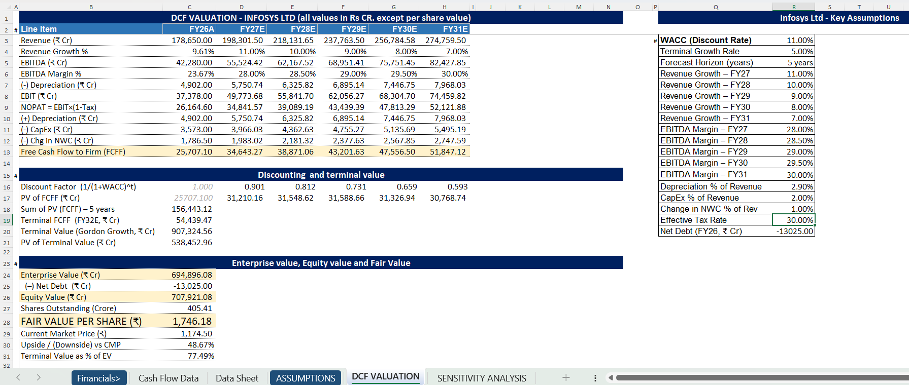
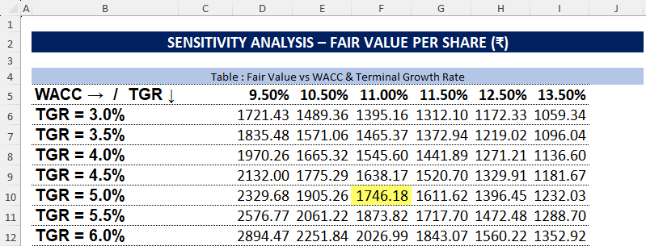

# 📈 Infosys Ltd - DCF Valuation Model

This repository contains a detailed **Discounted Cash Flow (DCF) Valuation Model** of **Infosys Ltd.**, built using the **FCFF (Free Cash Flow to Firm)** approach. The project estimates the intrinsic value of the company by forecasting future cash flows, discounting them using WACC, and performing sensitivity analysis.

---

## 📊 Excel File Overview

- **File Name**: `Infosys_DCF_Valuation_Model.xlsx`

### 📂 Structure

- **Financial Statements**
  - Historical Revenue & EBITDA Analysis
  - EBIT & NOPAT Calculations
  - Depreciation & CapEx Forecasting

- **DCF Valuation**
  - Revenue Growth Forecast
  - EBITDA Margin Assumptions
  - FCFF Calculation
  - Discounting using WACC
  - Terminal Value using Gordon Growth Method
  - Enterprise Value & Equity Value Estimation

- **Sensitivity Analysis**
  - Fair Value sensitivity across:
    - WACC assumptions
    - Terminal Growth Rate assumptions

---

## 🎯 Purpose

The objective of this project is to estimate the **intrinsic value of Infosys Ltd.** and compare it with the current market price to evaluate potential upside/downside.

This project demonstrates applied skills in:

- Financial Modeling
- DCF Valuation
- Equity Research
- Forecasting Financial Statements
- Microsoft Excel Modeling
- Sensitivity Analysis

---

## 🛠 Tools Used

- **Microsoft Excel** – Financial modeling, forecasting & valuation
- **Public Financial Statements** – Historical financial data source
- **DCF Valuation Methodology** – FCFF-based intrinsic valuation approach

---

## 📈 Key Assumptions

| Assumption | Value |
|---|---|
| WACC (Discount Rate) | 11.0% |
| Terminal Growth Rate | 5.0% |
| Forecast Period | 5 Years |
| Tax Rate | 30.0% |
| CapEx % of Revenue | 2.0% |
| Change in NWC % | 1.0% |

---

## 💰 Valuation Summary

| Metric | Value |
|---|---|
| Enterprise Value | ₹6,94,896 Cr |
| Equity Value | ₹7,07,921 Cr |
| Fair Value Per Share | ₹1,746 |
| Current Market Price | ₹1,174 |
| Upside Potential | 48.67% |

---

## 📸 Model Screenshots

### 🧾 DCF Valuation Model

### 📊 Sensitivity Analysis

---

## ✅ Key Insights

- Strong projected revenue growth supports long-term cash flow expansion.
- EBITDA margin improvement enhances profitability assumptions.
- High terminal value contribution reflects long-term business stability.
- Sensitivity analysis helps evaluate valuation under different market assumptions.
- Estimated fair value indicates potential upside compared to current market price.

---

## 📂 How to Access

1. Download or clone the repository.
2. Open `Infosys_DCF_Valuation_Model.xlsx` in Microsoft Excel.
3. Review:
   - Assumptions
   - DCF Valuation
   - Sensitivity Analysis
   - Financial Forecasts

---

## 📚 References

- Infosys Annual Reports
- Screener.in
- Moneycontrol
- Company Investor Presentations

---

## 🚀 Skills Demonstrated

- Financial Statement Forecasting
- DCF Valuation Modeling
- FCFF Calculation
- WACC Estimation
- Sensitivity Analysis
- Equity Valuation
- Advanced Excel Modeling

---

> 📌 This project is created purely for educational and portfolio purposes and should not be considered investment advice. The valuation assumptions are based on publicly available data and personal financial analysis.# DCF-Valuation-Infosys
